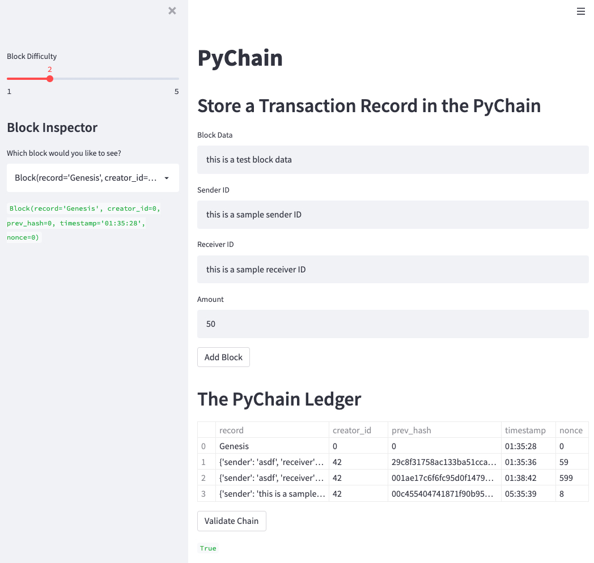
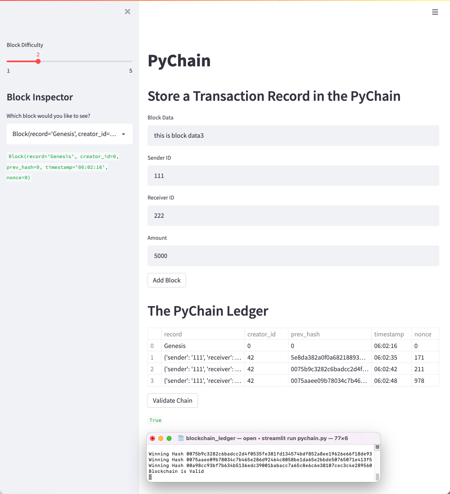

# Blockchain Ledger

This ledger allows bank partners to conduct financial transactions and to verify the integrity of the data in the ledger.  To deploy your ledger, run `streamlit run pychain.py` in your terminal.

---
## Streamlit

To install Streamlit library, open your `terminal` window and be sure to be in you `dev` virtual environment.  Run the following command
`pip install streamlit`.

Begin filling in each requested field and add to the block.  

Here's a screenshot of what you should see after creating several blocks.

You'll also be able to validate your blockchain.

---
## Contributors
Christina San Diego